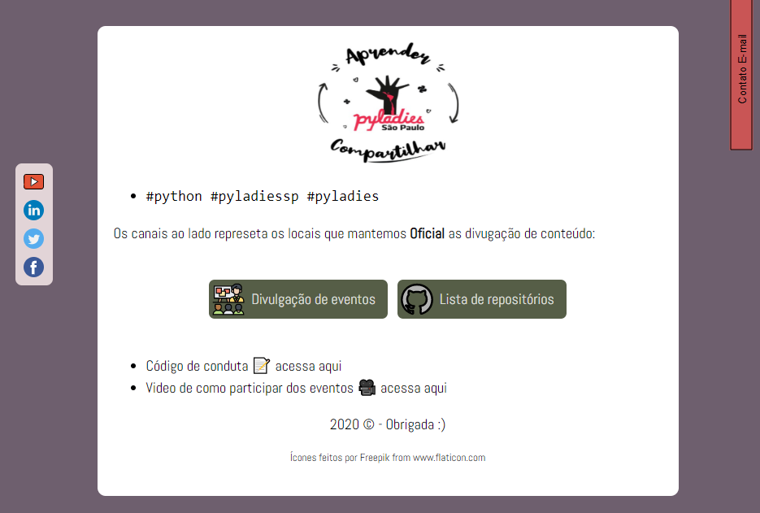

# Repositório do website das Pyladies São Paulo

Desenvolvimento do site da comunidade Pyladies na cidade de São Paulo.


## Estrutura do site
```bash
/
|--- Public # Pasta com conteúdo a ser rederizado
|     |---- assets
|     |     | Background.jpg
|     |     | Favicon
|     |     | logo_aprender.png
|     |     | print_screen.png
|     |     | treinamento.svg
|     | 
|     |---  Style
|           | main.css
|       
|---  repos_list # Pasta com arquivo readme com todos os links dos repositórios 
|     | readme.md
|
| 404.md
| index.html
| license
| readme.md 
```

## Print Screen



 Print Screen do layout Base, feito pela Daviny


## Ferramentas ultilizadas

* HTML
* CSS
  
## License

#### Licença Pública Geral GNU v3.0

As permissões desta licença copyleft forte estão condicionadas a disponibilizar o código fonte completo das obras e modificações licenciadas, que incluem obras maiores usando uma obra licenciada, sob a mesma licença. Os avisos de direitos autorais e licença devem ser preservados. Os colaboradores fornecem uma concessão expressa de direitos de patente.

##### Considerações finais
Layout baseado do layout inicial proposto pela
[Daviny Vidal](http://davinyvidal.github.io), sendo feito com 💜 para comunidade PyladiesSP